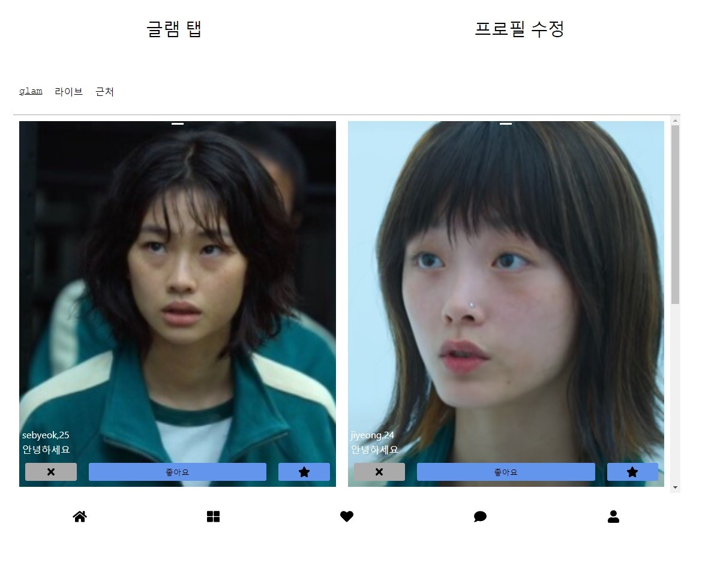
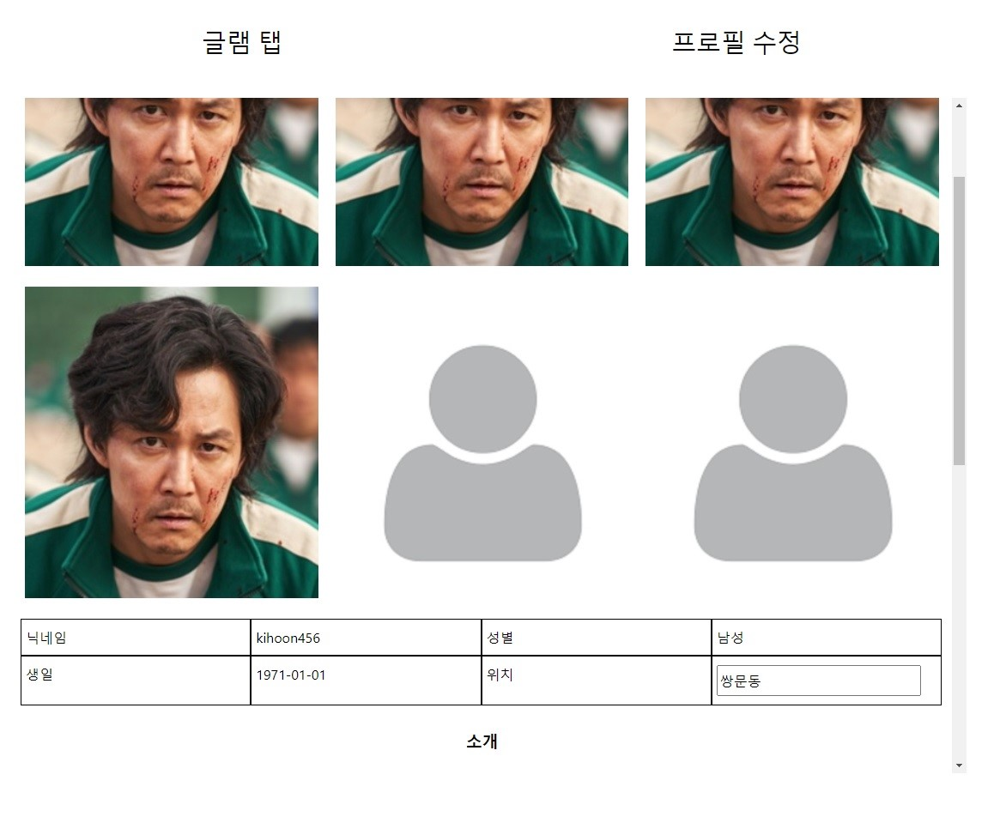
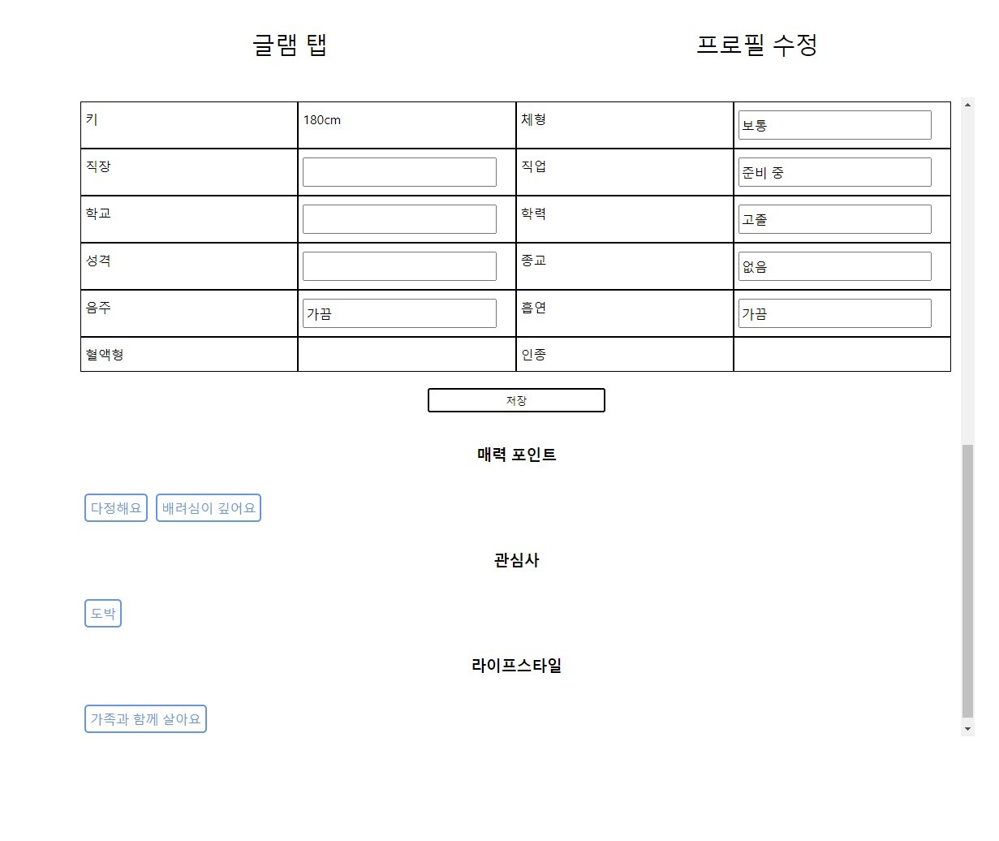

# cupist
## 글램 탭

## 프로필수정

구현 기술 및 사용 된 모듈 기재 및 해당 모듈에 대한 간략한 설명
# 구현 기술
* SPA: react
  - state에 저장된 데이터를 불러와 render
* 상태관리: redux
  - 불러온 데이터를 state에 담는다.
* fontawesome: 아이콘 사용 목적
* api: mock api 목적으로 mswjs/data 사용
  - js파일로 저장된 데이터를 불러온다.
* url: react-router 사용
  - App 컴포넌트 아래에 Main, Profile(./, ./updateProfile url) 두 개의 컴포넌트 생성.
* js : es6 사용
* html & css: flex를 이용한 레이아웃 설정

# 구현 기능
## 글램 탭
* 데이터 불러오기: 전체 user데이터를 불러온다.
* 취소(X) 기능: 화면에서 사라지고 다시 추천하지 않는다.
* 좋아요 기능: 화면에서 사라지고 상대방이 내가 누른 것을 알 수 있도록 데이터를 추가한다.

## 프로필 수정
* 데이터 불러오기: 나의 데이터를 불러온다.
* 사진 업로드: 사진을 변경 및 추가할 수 있다.
* 소개 정보 수정: 소개 항목을 수정할 수 있다.
